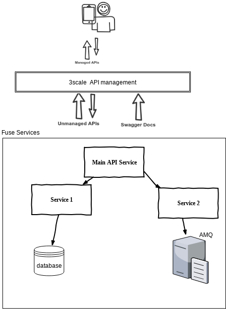

# 3ScaleFuseAMQ

## Demo Story

I'm a developer that's created an integration application consisting of
Multiple services working in combination (let's say single front end with dispatch to two back-ends)
One or more APIs that need to be managed via 3scale
One or more messaging destinations/addresses used for event-driven inputs and outputs
I now want to automate deployment of this application across multiple environments using pre-defined pipelines provided by the platform.  The delivery pipelines must support environment-specific properties, testing, versioning, and the ability to rollback incomplete or failed deployments.

**Products and Projects**

* OpenShift Container Platform
* Red Hat 3scale API Management
* Red Hat Fuse
* MySQl Database
* Red Hat AMQ
* Node JS (RHOAR) Web Application 
* Jenkins CICD

 Steps

* Design a application which integrated with Fuse , AMQ , 3Scale .
* Source to Image (S2i) build and deploy apps on openshift enviroment. 
* Building a pipeline to support automated CI/CD
* Exposing a REST API using Camel, and export API doc to swagger
* Pubslish API on 3scale enviroment using CI/CD pipeline .
* Manage the API through 3scale API management and update the application plan to rate-limit the application.
* Design a web application which invokes the 3scale API gateway .

## Application Environemnt

This demo application contains 4 parts.
 - Gatway application 
 - User Service application
 - Alert Service Application
 - Node Js Web application.
 

#### Building
The example can be built with

    mvn clean install

### Running the example in OpenShift

It is assumed that:
- OpenShift platform is already running, if not you can find details how to [Install OpenShift at your site](https://docs.openshift.com/container-platform/3.3/install_config/index.html).
- Your system is configured for Fabric8 Maven Workflow, if not you can find a [Get Started Guide](https://access.redhat.com/documentation/en/red-hat-jboss-middleware-for-openshift/3/single/red-hat-jboss-fuse-integration-services-20-for-openshift/)

The example can be built and run on OpenShift using a single goal:

    mvn fabric8:deploy

When the example runs in OpenShift, you can use the OpenShift client tool to inspect the status

To list all the running pods:

    oc get pods

Then find the name of the pod that runs this quickstart, and output the logs from the running pods with:

    oc logs <name of pod>

You can also use the OpenShift [web console](https://docs.openshift.com/container-platform/3.3/getting_started/developers_console.html#developers-console-video) to manage the
running pods, and view logs and much more.

### Running via an S2I Application Template

Application templates allow you deploy applications to OpenShift by filling out a form in the OpenShift console that allows you to adjust deployment parameters.  This template uses an S2I source build so that it handle building and deploying the application for you.

First, import the Fuse image streams:

    oc create -f https://raw.githubusercontent.com/jboss-fuse/application-templates/GA/fis-image-streams.json

Then create the quickstart template:

    oc create -f https://raw.githubusercontent.com/jboss-fuse/application-templates/GA/quickstarts/spring-boot-camel-template.json

Now when you use "Add to Project" button in the OpenShift console, you should see a template for this quickstart. 

